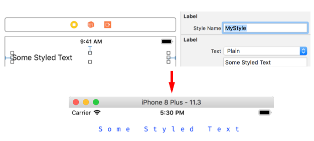
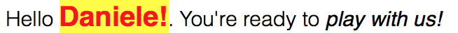
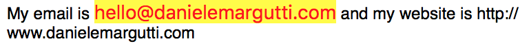
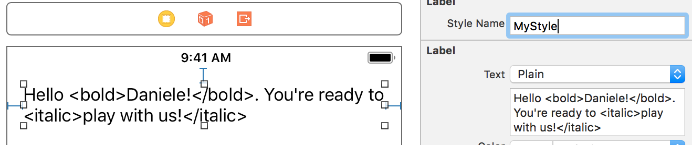

<p align="center" >

</p>

[](http://cocoadocs.org/docsets/SwiftRichString) [](http://cocoadocs.org/docsets/SwiftRichString) [](http://cocoadocs.org/docsets/SwiftRichString)
[](https://img.shields.io/cocoapods/v/SwiftRichString.svg)
[](https://github.com/Carthage/Carthage)
[](http://twitter.com/danielemargutti)

<p align="center" >★★ <b>Star me to follow the project! </b> ★★<br>
Created by <b>Daniele Margutti</b> - <a href="http://www.danielemargutti.com">danielemargutti.com</a>
</p>


SwiftRichString is a lightweight library which allows to create and manipulate attributed strings easily both in iOS, macOS, tvOS and even watchOS.
It provides convenient way to store styles you can reuse in your app's UI lements, allows complex tag-based strings rendering and also includes integration with Interface Builder.

If you manipulate `NSAttributedString` in Swift, SwiftRichString allows you to keep your code manteniable, readable and easy to evolve.

## Features Highlights

Want to know what SwiftRichString can do in your app? Lets take a look to these feature highlights!

### 1. Easy Styling
The main concept behind this lib is the `Style`: a style is just a collection of text attributes you can apply to a string. The following example show how to create a style an produce an attributed string with it:

```swift
let style = Style {
	$0.font = SystemFonts.AmericanTypewriter.font(size: 25) // just pass a string, one of the SystemFonts or an UIFont
	$0.color = "#0433FF" // you can use UIColor or HEX string!
	$0.underline = (.patternDot, UIColor.red)
	$0.alignment = .center
}
let attributedText = "Hello World!".set(style: style) // et voilà!
```

### 2. Global Styles & Interface Builder Integration
Styles can be also registered globally and reused in your app.
Just define your own style and register using `Styles.register()` function:

```swift
let myStyle = Style { // define style's attributes... }
Styles.register("MyStyle", style: style)
```

Now you can reuse it everything in your app; SwiftRichString exposes a `styleName` property for the most common text containers and you can set it directly in Interface Builder:



### 3. Complex Rendering with tag-based strings
SwiftRichString allows you to render complex strings by parsing text's tags: each style will be identified by an unique name (used inside the tag) and you can create a `StyleGroup` which allows you to encapsulate all of them and reuse as you need (clearly you can register it globally).

```swift
// Create your own styles

let normal = Style {
	$0.font = SystemFonts.Helvetica_Light.font(size: 15)
}
		
let bold = Style {
	$0.font = SystemFonts.Helvetica_Bold.font(size: 20)
	$0.color = UIColor.red
	$0.backColor = UIColor.yellow
}
		
let italic = normal.byAdding {
	$0.traitVariants = .italic
}

// Create a group which contains your style, each identified by a tag.
let myGroup = StyleGroup(base: normal, ["bold": bold, "italic": italic])
		
// Use tags in your plain string	
let str = "Hello <bold>Daniele!</bold>. You're ready to <italic>play with us!</italic>"
self.label?.attributedText = str.set(style: myGroup)
```

That's the result!



-- 

## Other Libraries You May Like

I'm also working on several other projects you may like.
Take a look below:


| Library         | Description                                      |
|-----------------|--------------------------------------------------|
| [**SwiftDate**](https://github.com/malcommac/SwiftDate)       | The best way to manage date/timezones in Swift   |
| [**Hydra**](https://github.com/malcommac/Hydra)           | Write better async code: async/await & promises  |
| [**FlowKit**](https://github.com/malcommac/FlowKit) | A new declarative approach to table/collection managment. Forget datasource & delegates. |
| [**SwiftRichString**](https://github.com/malcommac/SwiftRichString) | Elegant & Painless NSAttributedString in Swift   |
| [**SwiftLocation**](https://github.com/malcommac/SwiftLocation)   | Efficient location manager                       |
| [**SwiftMsgPack**](https://github.com/malcommac/SwiftMsgPack)    | Fast/efficient msgPack encoder/decoder           |
</p>

--

## Documentation

**Are you using SwiftRichString 1.x in your project? Don't miss to take a look at [Migration section of the documentation](#migration).**
You can still use the 1.x release by using tagged version 1.1.0.

**Table Of Contents**

Full changelog is available in [CHANGELOG.md](CHANGELOG.md) file.

- [Versions (1.x, 2.x and old Swift 3.x branch)](#versions)
- [Introduction to `Style`, `StyleGroup` & `StyleRegEx`](#stylestylegroup)
	- [Introduction](#introduction)
	- [String & Attributed String concatenation](#concatenation)
	- [Apply styles to `String` & `Attributed String`](#manualstyling)
	- [Fonts & Colors in `Style`](#fontscolors)
	- [Derivating a `Style`](#derivatingstyle)
- [The `StyleManager`](#stylemanager)
	- [Register globally available styles](#globalregister)
	- [Defer style creation on demand](#defer)
- [Assign style using Interface Builder](#ib)
- [All properties of `Style`](#props)

Other info:

- [Migration from SwiftRichString 1.x](#migration)
- [Requirements](#requirements)
- [Installation](#installation)
- [Contributing](#contributing)
- [Copyright](#copyright)

<a name="versions"/>

### Versions

- **SwiftRichString 2.x branch (current)**. The latest version is [2.0.2](https://github.com/malcommac/SwiftRichString/releases/tag/2.0.2).
- **SwiftRichString 1.x branch (supported)**. Use [1.1.0 tag](https://github.com/malcommac/SwiftRichString/releases/tag/1.1.0). Its compatible with Swift 4.x.
- **Swift 3.x (no longer mantained)**. Use [0.9.1 release](https://github.com/malcommac/SwiftRichString/releases/tag/0.9.10).

<a name="stylestylegroup"/>

## Introduction to `Style`, `StyleGroup`, `StyleRegEx`

<a name="introduction"/>

### Introduction

The main concept behind SwiftRichString is the use of `StyleProtocol` as generic container of the attributes you can apply to both `String` and `NSMutableAttributedString`.
Concrete classes derivated by `StyleProtocol` are: `Style`, `StyleGroup` and `StyleRegEx`.

Each of these classes can be used as source for styles you can apply to a string, substring or attributed string.


#### `Style`: apply style to strings or attributed strings

A `Style` is a class which encapsulate all the attributes you can apply to a string. The vast majority of the attributes of both AppKit/UIKit are currently available via type-safe properties by this class.

Creating a `Style` instance is pretty simple; using a builder pattern approach the init class require a callback where the self instance is passed and allows you to configure your properties by keeping the code clean and readable:

```swift
let style = Style {
	$0.font = SystemFonts.Helvetica_Bold.font(size: 20)
	$0.color = UIColor.green
	// ... set any other attribute
}

let attrString = "Some text".set(style: style) // attributed string
```

#### `StyleGroup`: Apply styles for tag-based complex string

`Style` instances are anonymous; if you want to use a style instance to render a tag-based plain string you need to include it inside a `StyleGroup`. You can consider a `StyleGroup` as a container of `Styles` (but, in fact, thanks to the conformance to a common `StyleProtocol`'s protocol your group may contains other sub-groups too).

```swift
let bodyStyle: Style = ...
let h1Style: Style = ...
let h2Style: Style = ...
let group = StyleGroup(base: bodyStyle, ["h1": h1Style, "h2": h2Style])

let attrString = "Some <h1>text</h1>, <h2>welcome here</h2>".set(style: group)
```

The following code defines a group where:

- we have defined a base style. Base style is the style applied to the entire string and can be used to provide a base ground of styles you want to apply to the string.
- we have defined two other styles named `h1` and `h2`; these styles are applied to the source string when parser encounter some text enclosed by these tags.


#### `StyleRegEx`: Apply styles via regular expressions

`StyleRegEx` allows you to define a style which is applied when certain regular expression is matched inside the target string/attributed string.

```swift
let emailPattern = "([A-Za-z0-9_\\-\\.\\+])+\\@([A-Za-z0-9_\\-\\.])+\\.([A-Za-z]+)"
let style = StyleRegEx(pattern: emailPattern) {
	$0.color = UIColor.red
	$0.backColor = UIColor.yellow
}
		
let attrString = "My email is hello@danielemargutti.com and my website is http://www.danielemargutti.com".(style: style!)
```

The result is this:



<a name="concatenation"/>

### String & Attributed String concatenation
SwiftRichString allows you to simplify string concatenation by providing custom `+` operator between `String`,`AttributedString` (typealias of `NSMutableAttributedString`) and `Style`.

This a an example:

```swift
let body: Style = Style { ... }
let big: Style = Style { ... }
let attributed: AttributedString = "hello ".set(style: body)

// the following code produce an attributed string by
// concatenating an attributed string and two plain string
// (one styled and another plain).
let attStr = attributed + "\(username)!".set(style:big) + ". You are welcome!"
```

You can also use `+` operator to add a style to a plain or attributed string:

```swift
// This produce an attributed string concatenating a plain
// string with an attributed string created via + operator
// between a plain string and a style
let attStr = "Hello" + ("\(username)" + big)
```

<a name="manualstyling"/>

### Apply styles to `String` & `Attributed String`

Both `String` and `Attributed String` (aka `NSMutableAttributedString`) has a come convenience methods you can use to create an manipulate attributed text easily via code:

#### Strings Instance Methods

- `set(style: String, range: NSRange? = nil)`: apply a globally registered style to the string (or a substring) by producing an attributed string.
- `set(styles: [String], range: NSRange? = nil)`: apply an ordered sequence of globally registered styles to the string (or a substring) by producing an attributed string.
- `set(style: StyleProtocol, range: NSRange? = nil)`: apply an instance of `Style` or `StyleGroup` (to render tag-based text) to the string (or a substring) by producting an attributed string.
- `set(styles: [StyleProtocol], range: NSRange? = nil)`: apply a sequence of `Style`/`StyleGroup` instance in order to produce a single attributes collection which will be applied to the string (or substring) to produce an attributed string.

Some examples:

```swift
// apply a globally registered style named MyStyle to the entire string
let a1: AttributedString = "Hello world".set(style: "MyStyle")

// apply a style group to the entire string
// commonStyle will be applied to the entire string as base style
// styleH1 and styleH2 will be applied only for text inside that tags.
let styleH1: Style = ...
let styleH2: Style = ...
let styleGroup = StyleGroup(base: commonStyle, ["h1" : styleH1, "h2" : styleH2])
let a2: AttributedString = "Hello <h1>world</h1>, <h2>welcome here</h2>".set(style: styleGroup)

// Apply a style defined via closure to a portion of the string
let a3 = "Hello Guys!".set(Style({ $0.font = SystemFonts.Helvetica_Bold.font(size: 20) }), range: NSMakeRange(0,4))
```

#### AttributedString Instance Methods

Similar methods are also available to attributed strings.

There are three categories of methods:

- `set` methods replace any existing attributes already set on target.
- `add` add attributes defined by style/styles list to the target
- `remove` remove attributes defined from the receiver string.

Each of this method alter the receiver instance of the attributed string and also return the same instance in output (so chaining is allowed).

**Add**

- `add(style: String, range: NSRange? = nil)`: add to existing style of string/substring a globally registered style with given name.
- `add(styles: [String], range: NSRange? = nil)`: add to the existing style of string/substring a style which is the sum of ordered sequences of globally registered styles with given names.
- `add(style: StyleProtocol, range: NSRange? = nil)`: append passed style instance to string/substring by altering the receiver attributed string.
- `add(styles: [StyleProtocol], range: NSRange? = nil)`: append passed styles ordered sequence to string/substring by altering the receiver attributed string.

**Set**

- `set(style: String, range: NSRange? = nil)`: replace any existing style inside string/substring with the attributes defined inside the globally registered style with given name.
- `set(styles: [String], range: NSRange? = nil)`: replace any existing style inside string/substring with the attributes merge of the ordered sequences of globally registered style with given names.
- `set(style: StyleProtocol, range: NSRange? = nil)`: replace any existing style inside string/substring with the attributes of the passed style instance.
- `set(styles: [StyleProtocol], range: NSRange? = nil)`: replace any existing style inside string/substring with the attributes of the passed ordered sequence of styles.

**Remove**

- `removeAttributes(_ keys: [NSAttributedStringKey], range: NSRange)`: remove attributes specified by passed keys from string/substring.
- `remove(_ style: StyleProtocol)`: remove attributes specified by the style from string/substring.

Example:

```swift
let a = "hello".set(style: styleA)
let b = "world!".set(style: styleB)
let ab = (a + b).add(styles: [coupondStyleA,coupondStyleB]).remove([.foregroundColor,.font])
```

<a name="fontscolors"/>

## Fonts & Colors in `Style`
All colors and fonts you can set for a `Style` are wrapped by `FontConvertible` and `ColorConvertible` protocols.

SwiftRichString obviously implements these protocols for `UIColor`/`NSColor`, `UIFont`/`NSFont` but also for `String`.
For Fonts this mean you can assign a font by providing directly its PostScript name and it will be translated automatically to a valid instance:

```swift
let firaLight: UIFont = "FiraCode-Light".font(ofSize: 14)
...
...
let style = Style {
	$0.font = "Jura-Bold"
	$0.size = 24
	...
}
```

On UIKit you can also use the `SystemFonts` enum to pick from a type-safe auto-complete list of all available iOS fonts:

```swift
let font1 = SystemFonts.Helvetica_Light.font(size: 15)
let font2 = SystemFonts.Avenir_Black.font(size: 24)
```

For Color this mean you can create valid color instance from HEX strings:

```swift
let color: UIColor = "#0433FF".color
...
...
let style = Style {
	$0.color = "#0433FF"
	...
}
```

Clearly you can still pass instances of both colors/fonts.

<a name="derivatingstyle"/>

### Derivating a `Style`

Sometimes you may need to infer properties of a new style from an existing one. In this case you can use `byAdding()` function of `Style` to produce a new style with all the properties of the receiver and the chance to configure additional/replacing attributes.

```swift
let initialStyle = Style {
	$0.font = SystemFonts.Helvetica_Light.font(size: 15)
	$0.alignment = right
}

// The following style contains all the attributes of initialStyle
// but also override the alignment and add a different foreground color.
let subStyle = bold.byAdding {
	$0.alignment = center
	$0.color = UIColor.red
}
``` 
<a name="stylemanager"/>

## The `StyleManager`

<a name="globalregister"/>

### Register globally available styles
Styles can be created as you need or registered globally to be used once you need.
This second approach is strongly suggested because allows you to theme your app as you need and also avoid duplication of the code.

To register a `Style` or a `StyleGroup` globally you need to assign an unique identifier to it and call `register()` function via `Styles` shortcut (which is equal to call `StylesManager.shared`).

In order to keep your code type-safer you can use a non-instantiable struct to keep the name of your styles, then use it to register style:

```swift
// Define a struct with your styles names
public struct StyleNames {
	public static let body: String = "body"
	public static let h1: String = "h1"
	public static let h2: String = "h2"
	
	private init { }
}
```

Then you can:

```swift
let bodyStyle: Style = ...
Styles.register(StyleNames.body, bodyStyle)
```

Now you can use it everywhere inside the app; you can apply it to a text just using its name:

```swift
let text = "hello world".set(StyleNames.body)
```

or you can assign `body` string to the `styledText` via Interface Builder designable property.

<a name="defer"/>

### Defer style creation on demand
Sometimes you may need to return a particular style used only in small portion of your app; while you can still set it directly you can also defer its creation in `StylesManager`.

By implementing `onDeferStyle()` callback you have an option to create a new style once required: you will receive the identifier of the style.

```swift
Styles.onDeferStyle = { name in
			
	if name == "MyStyle" {
		let normal = Style {
			$0.font = SystemFonts.Helvetica_Light.font(size: 15)
		}
				
		let bold = Style {
			$0.font = SystemFonts.Helvetica_Bold.font(size: 20)
			$0.color = UIColor.red
			$0.backColor = UIColor.yellow
		}
				
		let italic = normal.byAdding {
			$0.traitVariants = .italic
		}
				
		return (StyleGroup(base: normal, ["bold": bold, "italic": italic]), true)
	}
			
	return (nil,false)
}
```
The following code return a valid style for `myStyle` identifier and cache it; if you don't want to cache it just return `false` along with style instance.

Now you can use your style to render, for example, a tag based text into an `UILabel`: just set the name of the style to use.



<a name="ib"/>

## Assign style using Interface Builder
SwiftRichString can be used also via Interface Builder.

- `UILabel`
- `UITextView`
- `UITextField`

has three additional properties:

- `styleName: String` (available via IB): you can set it to render the text already set via Interface Builder with a style registered globally before the parent view of the UI control is loaded.
- `style: StyleProtocol`: you can set it to render the text of the control with an instance of style instance.
- `styledText: String`: use this property, instead of `attributedText` to set a new text for the control and render it with already set style. You can continue to use `attributedText` and set the value using `.set()` functions of `String`/`AttributedString`.

Assigned style can be a `Style`, `StyleGroup` or `StyleRegEx`:

- if style is a `Style` the entire text of the control is set with the attributes defined by the style.
- if style is a `StyleGroup` a base attribute is set (if `base` is valid) and other attributes are applied once each tag is found.
- if style is a `StyleRegEx` a base attribute is set (if `base` is valid) and the attribute is applied only for matches of the specified pattern.

Typically you will set the style of a label via `Style Name` (`styleName`) property in IB and update the content of the control by setting the `styledText`:

```swift
// use `styleName` set value to update a text with the style
self.label?.styledText = "Another text to render" // text is rendered using specified `styleName` value.
```

Otherwise you can set values manually:

```swift
// manually set the an attributed string
self.label?.attributedText = (self.label?.text ?? "").set(myStyle)

// manually set the style via instance
self.label?.style = myStyle
self.label?.styledText = "Updated text"
```

<a name="props"/>

## Properties available via `Style` class
The following properties are available:

| PROPERTY                      | TYPE                                  | DESCRIPTION                                                                                                                                | 
|-------------------------------|---------------------------------------|--------------------------------------------------------------------------------------------------------------------------------------------| 
| size                          | `CGFloat`                               | font size in points                                                                                                                        | 
| font                          | `FontConvertible`                       | font used in text                                                                                                                          | 
| color                         | `ColorConvertible`                      | foreground color of the text                                                                                                               | 
| backColor                     | `ColorConvertible`                      | background color of the text                                                                                                               | 
| shadow                     | `NSShadow`                      | shadow effect of the text                                                                                                             | 
| underline                     | `(NSUnderlineStyle?,ColorConvertible?)` | underline style and color (if color is nil foreground is used)                                                                             | 
| strikethrough                 | `(NSUnderlineStyle?,ColorConvertible?)` | strikethrough style and color (if color is nil foreground is used)                                                                         | 
| baselineOffset                | `Float`                                 | character’s offset from the baseline, in point                                                                                             | 
| paragraph                     | `NSMutableParagraphStyle`               | paragraph attributes                                                                                                                       | 
| lineSpacing                   | `CGFloat`                               | distance in points between the bottom of one line fragment and the top of the next                                                         | 
| paragraphSpacingBefore        | `CGFloat`                               | distance between the paragraph’s top and the beginning of its text content                                                                 | 
| paragraphSpacingAfter         | `CGFloat`                               | space (measured in points) added at the end of the paragraph                                                                               | 
| alignment                     | `NSTextAlignment`                       | text alignment of the receiver                                                                                                             | 
| firstLineHeadIndent           | `CGFloat`                               | distance (in points) from the leading margin of a text container to the beginning of the paragraph’s first line.                           | 
| headIndent                    | `CGFloat`                               | The distance (in points) from the leading margin of a text container to the beginning of lines other than the first.                       | 
| tailIndent                    | `CGFloat`                               | this value is the distance from the leading margin, If 0 or negative, it’s the distance from the trailing margin.                          | 
| lineBreakMode                 | `LineBreak`                             | mode that should be used to break lines                                                                                                    | 
| minimumLineHeight             | `CGFloat`                               | minimum height in points that any line in the receiver will occupy regardless of the font size or size of any attached graphic             | 
| maximumLineHeight             | `CGFloat`                               | maximum height in points that any line in the receiver will occupy regardless of the font size or size of any attached graphic             | 
| baseWritingDirection          | `NSWritingDirection`                    | initial writing direction used to determine the actual writing direction for text                                                          | 
| lineHeightMultiple            | `CGFloat`                               | natural line height of the receiver is multiplied by this factor (if positive) before being constrained by minimum and maximum line height | 
| hyphenationFactor             | `Float`                                 | threshold controlling when hyphenation is attempted                                                                                        | 
| ligatures                     | `Ligatures`                             | Ligatures cause specific character combinations to be rendered using a single custom glyph that corresponds to those characters            | 
| speaksPunctuation             | `Bool`                                  | Enable spoken of all punctuation in the text                                                                                               | 
| speakingLanguage              | `String`                                | The language to use when speaking a string (value is a BCP 47 language code string).                                                       | 
| speakingPitch                 | `Double`                                | Pitch to apply to spoken content                                                                                                           | 
| speakingPronunciation         | `String`                                |                                                                                                                                            | 
| shouldQueueSpeechAnnouncement | `Bool`                                  | Spoken text is queued behind, or interrupts, existing spoken content                                                                       | 
| headingLevel                  | `HeadingLevel`                          | Specify the heading level of the text                                                                                                      | 
| numberCase                    | `NumberCase`                            | "Configuration for the number case, also known as ""figure style"""                                                                        | 
| numberSpacing                 | `NumberSpacing`                         | "Configuration for number spacing, also known as ""figure spacing"""                                                                       | 
| fractions                     | `Fractions`                             | Configuration for displyaing a fraction                                                                                                    | 
| superscript                   | `Bool`                                  | Superscript (superior) glpyh variants are used, as in footnotes_.                                                                          | 
| `subscript`                   | `Bool`                                  | Subscript (inferior) glyph variants are used: v_.                                                                                          | 
| ordinals                      | `Bool`                                  | Ordinal glyph variants are used, as in the common typesetting of 4th.                                                                      | 
| scientificInferiors           | `Bool`                                  | Scientific inferior glyph variants are used: H_O                                                                                           | 
| smallCaps                     | `Set<SmallCaps>`                       | Configure small caps behavior.                                                                                                             | 
| stylisticAlternates           | `StylisticAlternates`                   | Different stylistic alternates available for customizing a font.                                                                           | 
| contextualAlternates          | `ContextualAlternates`                  | Different contextual alternates available for customizing a font.                                                                          | 
| kerning                       | `Kerning`                               | Tracking to apply.                                                                                                                         | 
| traitVariants                 | `TraitVariant`                          | Describe trait variants to apply to the font                                                                                               | 

<a name="migration"/>

## Migration from 1.x
SwiftRichString is a complete rewrite of the library. While some inner concept are the same, in order to keep the code cleaner and simpler I've made some important changes.

- A `StyleProtocol` is now a common entry point for every style definition; both `Style` and `StyleGroup` are conform to this protocol which is the central repository to make actions on text (in 1.x `String` and `AttributedString` act directly to parse text).
- `Style` some properties of the class has a different (but quite equal) name, changed to better reflect the purpose of the attribute. Some attributes like `underline` or `striketought` are now tuple of elements instead of different properties.
- `Style` are now anonymous; you don't need to assign a name to a style; only if you need to parse tag-based text you need to group used styles in a `StyleGroup` instance where you define the name/id of each tag.
- There is not any `parseTag` function; just pass the `StyleGroup` as parameter to render a text and the tag-based parsing will be done automatically.
- There is not any default style; `StyleGroup` implements a `base` style used to render common attributes of your text. You can also use `Styles` to register globally available `StyleProtocol` instances and use them in your app.
- In order to simplify our APIs some init methods of `Style` are now removed. You should not miss them, but let me know via PR in case.

<a name="requirements"/>

## Requirements

SwiftRichString is compatible with Swift 4.x.
All Apple platforms are supported:

* iOS 8.0+
* macOS 10.10+
* watchOS 2.0+
* tvOS 11.0+

<a name="installation"/>

## Installation

<a name="cocoapods" />

### Install via CocoaPods

[CocoaPods](http://cocoapods.org) is a dependency manager for Objective-C, which automates and simplifies the process of using 3rd-party libraries like SwiftRichString in your projects. You can install it with the following command:

```bash
$ sudo gem install cocoapods
```

> CocoaPods 1.0.1+ is required to build SwiftRichString.

#### Install via Podfile

To integrate SwiftRichString into your Xcode project using CocoaPods, specify it in your `Podfile`:

```ruby
source 'https://github.com/CocoaPods/Specs.git'
platform :ios, '8.0'

target 'TargetName' do
use_frameworks!
pod 'SwiftRichString'
end
```

Then, run the following command:

```bash
$ pod install
```

<a name="carthage" />

### Carthage

[Carthage](https://github.com/Carthage/Carthage) is a decentralized dependency manager that builds your dependencies and provides you with binary frameworks.

You can install Carthage with [Homebrew](http://brew.sh/) using the following command:

```bash
$ brew update
$ brew install carthage
```

To integrate SwiftRichString into your Xcode project using Carthage, specify it in your `Cartfile`:

```ogdl
github "malcommac/SwiftRichString"
```

Run `carthage` to build the framework and drag the built `SwiftRichString.framework` into your Xcode project.

<a name="contributing" />

## Contributing

Issues and pull requests are welcome!
Contributors are expected to abide by the [Contributor Covenant Code of Conduct](https://github.com/malcommac/SwiftRichString/blob/master/CONTRIBUTING.md).

## Copyright

SwiftRichString is available under the MIT license. See the LICENSE file for more info.

Daniele Margutti: [hello@danielemargutti.com](mailto:hello@danielemargutti.com), [@danielemargutti](https://twitter.com/danielemargutti)


