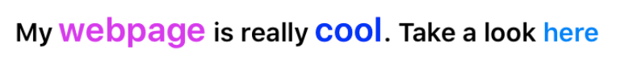
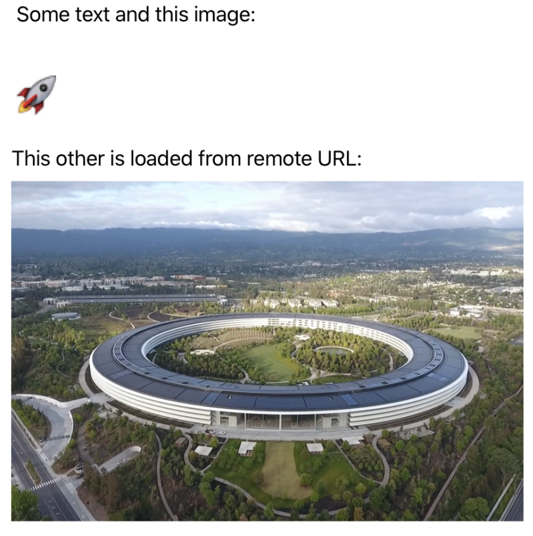

<p align="center" >

</p>

[](http://cocoadocs.org/docsets/SwiftRichString) [](http://cocoadocs.org/docsets/SwiftRichString) 
[](https://github.com/Carthage/Carthage)
[](http://twitter.com/danielemargutti)

SwiftRichString is a lightweight library which allows to create and manipulate attributed strings easily both in iOS, macOS, tvOS and even watchOS.
It provides convenient way to store styles you can reuse in your app's UI elements, allows complex tag-based strings rendering and also includes integration with Interface Builder.

## Main Features

|  	| Features Highlights 	|
|---	|---------------------------------------------------------------------------------	|
| 🦄 	| Easy styling and typography managment with coincise declarative syntax	|
| 🏞 	| Attach local images (lazy/static) and remote images inside text 	|
| 🧬 	| Fast & high customizable XML/HTML tagged string rendering 	|
| 🌟 	| Apply text transforms within styles	|
| 📐 	| Native support for iOS 11 Dynamic Type	|
| 🖇 	| Support for Swift 5.1's function builder to compose strings	|
| ⏱ 	| Compact code base with no external dependencies. 	|
| 🐦 	| Fully made in Swift 5 from Swift ❥ lovers 	|

### Easy Styling

```swift
let style = Style {
	$0.font = SystemFonts.AmericanTypewriter.font(size: 25) // just pass a string, one of the SystemFonts or an UIFont
	$0.color = "#0433FF" // you can use UIColor or HEX string!
	$0.underline = (.patternDot, UIColor.red)
	$0.alignment = .center
}
let attributedText = "Hello World!".set(style: style) // et voilà!
```

### XML/HTML tag based rendering
SwiftRichString allows you to render complex strings by parsing text's tags: each style will be identified by an unique name (used inside the tag) and you can create a `StyleXML` (was `StyleGroup`) which allows you to encapsulate all of them and reuse as you need (clearly you can register it globally).

```swift
// Create your own styles

let normal = Style {
	$0.font = SystemFonts.Helvetica_Light.font(size: 15)
}
		
let bold = Style {
	$0.font = SystemFonts.Helvetica_Bold.font(size: 20)
	$0.color = UIColor.red
	$0.backColor = UIColor.yellow
}
		
let italic = normal.byAdding {
	$0.traitVariants = .italic
}

let myGroup = StyleXML(base: normal, ["bold": bold, "italic": italic])
let str = "Hello <bold>Daniele!</bold>. You're ready to <italic>play with us!</italic>"
self.label?.attributedText = str.set(style: myGroup)
```

That's the result!


## Documentation

- [Introduction to `Style`, `StyleXML` & `StyleRegEx`](#styleStyleXML)
	- [String & Attributed String concatenation](#concatenation)
	- [Apply styles to `String` & `Attributed String`](#manualstyling)
	- [Fonts & Colors in `Style`](#fontscolors)
	- [Derivating a `Style`](#derivatingstyle)
	- [Support Dynamic Type](#dynamictype)
	- [Render XML tagged strings](#customizexmlstrings)
	- [Customize XML rendering: react to tag's attributes and unknown tags](#xmlstrings)
	- [Custom text transforms](#texttransforms)
	- [Local & Remote Images inside text](#images)
- [The `StyleManager`](#stylemanager)
	- [Register globally available styles](#globalregister)
	- [Defer style creation on demand](#defer)
- [Assign style using Interface Builder](#ib)
- [All properties of `Style`](#props)

Other info:

- [Requirements](#requirements)
- [Installation](#installation)
- [Contributing](#contributing)
- [Copyright](#copyright)

<a name="styleStyleXML"/>

## Introduction to `Style`, `StyleXML`, `StyleRegEx`

The main concept behind SwiftRichString is the use of `StyleProtocol` as generic container of the attributes you can apply to both `String` and `NSMutableAttributedString`.
Concrete classes derivated by `StyleProtocol` are: `Style`, `StyleXML` and `StyleRegEx`.

Each of these classes can be used as source for styles you can apply to a string, substring or attributed string.


### `Style`: apply style to strings or attributed strings

A `Style` is a class which encapsulate all the attributes you can apply to a string. The vast majority of the attributes of both AppKit/UIKit are currently available via type-safe properties by this class.

Creating a `Style` instance is pretty simple; using a builder pattern approach the init class require a callback where the self instance is passed and allows you to configure your properties by keeping the code clean and readable:

```swift
let style = Style {
	$0.font = SystemFonts.Helvetica_Bold.font(size: 20)
	$0.color = UIColor.green
	// ... set any other attribute
}

let attrString = "Some text".set(style: style) // attributed string
```

### `StyleXML`: Apply styles for tag-based complex string

`Style` instances are anonymous; if you want to use a style instance to render a tag-based plain string you need to include it inside a `StyleXML`. You can consider a `StyleXML` as a container of `Styles` (but, in fact, thanks to the conformance to a common `StyleProtocol`'s protocol your group may contains other sub-groups too).

```swift
let bodyStyle: Style = ...
let h1Style: Style = ...
let h2Style: Style = ...
let group = StyleXML(base: bodyStyle, ["h1": h1Style, "h2": h2Style])

let attrString = "Some <h1>text</h1>, <h2>welcome here</h2>".set(style: group)
```

The following code defines a group where:

- we have defined a base style. Base style is the style applied to the entire string and can be used to provide a base ground of styles you want to apply to the string.
- we have defined two other styles named `h1` and `h2`; these styles are applied to the source string when parser encounter some text enclosed by these tags.


### `StyleRegEx`: Apply styles via regular expressions

`StyleRegEx` allows you to define a style which is applied when certain regular expression is matched inside the target string/attributed string.

```swift
let emailPattern = "([A-Za-z0-9_\\-\\.\\+])+\\@([A-Za-z0-9_\\-\\.])+\\.([A-Za-z]+)"
let style = StyleRegEx(pattern: emailPattern) {
	$0.color = UIColor.red
	$0.backColor = UIColor.yellow
}
		
let attrString = "My email is hello@danielemargutti.com and my website is http://www.danielemargutti.com".(style: style!)
```

The result is this:


<a name="concatenation"/>

## String & Attributed String concatenation
SwiftRichString allows you to simplify string concatenation by providing custom `+` operator between `String`,`AttributedString` (typealias of `NSMutableAttributedString`) and `Style`.

This a an example:

```swift
let body: Style = Style { ... }
let big: Style = Style { ... }
let attributed: AttributedString = "hello ".set(style: body)

// the following code produce an attributed string by
// concatenating an attributed string and two plain string
// (one styled and another plain).
let attStr = attributed + "\(username)!".set(style:big) + ". You are welcome!"
```

You can also use `+` operator to add a style to a plain or attributed string:

```swift
// This produce an attributed string concatenating a plain
// string with an attributed string created via + operator
// between a plain string and a style
let attStr = "Hello" + ("\(username)" + big)
```

Finally you can concatente strings using function builders:

```swift
let bold = Style { ... }
let italic = Style { ... }
        
let attributedString = AttributedString.composing {
  "hello".set(style: bold)
  "world".set(style: italic)
}
```

<a name="manualstyling"/>

## Apply styles to `String` & `Attributed String`

Both `String` and `Attributed String` (aka `NSMutableAttributedString`) has a come convenience methods you can use to create an manipulate attributed text easily via code:

### Strings Instance Methods

- `set(style: String, range: NSRange? = nil)`: apply a globally registered style to the string (or a substring) by producing an attributed string.
- `set(styles: [String], range: NSRange? = nil)`: apply an ordered sequence of globally registered styles to the string (or a substring) by producing an attributed string.
- `set(style: StyleProtocol, range: NSRange? = nil)`: apply an instance of `Style` or `StyleXML` (to render tag-based text) to the string (or a substring) by producting an attributed string.
- `set(styles: [StyleProtocol], range: NSRange? = nil)`: apply a sequence of `Style`/`StyleXML` instance in order to produce a single attributes collection which will be applied to the string (or substring) to produce an attributed string.

Some examples:

```swift
// apply a globally registered style named MyStyle to the entire string
let a1: AttributedString = "Hello world".set(style: "MyStyle")

// apply a style group to the entire string
// commonStyle will be applied to the entire string as base style
// styleH1 and styleH2 will be applied only for text inside that tags.
let styleH1: Style = ...
let styleH2: Style = ...
let StyleXML = StyleXML(base: commonStyle, ["h1" : styleH1, "h2" : styleH2])
let a2: AttributedString = "Hello <h1>world</h1>, <h2>welcome here</h2>".set(style: StyleXML)

// Apply a style defined via closure to a portion of the string
let a3 = "Hello Guys!".set(Style({ $0.font = SystemFonts.Helvetica_Bold.font(size: 20) }), range: NSMakeRange(0,4))
```

### AttributedString Instance Methods

Similar methods are also available to attributed strings.

There are three categories of methods:

- `set` methods replace any existing attributes already set on target.
- `add` add attributes defined by style/styles list to the target
- `remove` remove attributes defined from the receiver string.

Each of this method alter the receiver instance of the attributed string and also return the same instance in output (so chaining is allowed).

**Add**

- `add(style: String, range: NSRange? = nil)`: add to existing style of string/substring a globally registered style with given name.
- `add(styles: [String], range: NSRange? = nil)`: add to the existing style of string/substring a style which is the sum of ordered sequences of globally registered styles with given names.
- `add(style: StyleProtocol, range: NSRange? = nil)`: append passed style instance to string/substring by altering the receiver attributed string.
- `add(styles: [StyleProtocol], range: NSRange? = nil)`: append passed styles ordered sequence to string/substring by altering the receiver attributed string.

**Set**

- `set(style: String, range: NSRange? = nil)`: replace any existing style inside string/substring with the attributes defined inside the globally registered style with given name.
- `set(styles: [String], range: NSRange? = nil)`: replace any existing style inside string/substring with the attributes merge of the ordered sequences of globally registered style with given names.
- `set(style: StyleProtocol, range: NSRange? = nil)`: replace any existing style inside string/substring with the attributes of the passed style instance.
- `set(styles: [StyleProtocol], range: NSRange? = nil)`: replace any existing style inside string/substring with the attributes of the passed ordered sequence of styles.

**Remove**

- `removeAttributes(_ keys: [NSAttributedStringKey], range: NSRange)`: remove attributes specified by passed keys from string/substring.
- `remove(_ style: StyleProtocol)`: remove attributes specified by the style from string/substring.

Example:

```swift
let a = "hello".set(style: styleA)
let b = "world!".set(style: styleB)
let ab = (a + b).add(styles: [coupondStyleA,coupondStyleB]).remove([.foregroundColor,.font])
```

<a name="fontscolors"/>

## Fonts & Colors in `Style`
All colors and fonts you can set for a `Style` are wrapped by `FontConvertible` and `ColorConvertible` protocols.

SwiftRichString obviously implements these protocols for `UIColor`/`NSColor`, `UIFont`/`NSFont` but also for `String`.
For Fonts this mean you can assign a font by providing directly its PostScript name and it will be translated automatically to a valid instance:

```swift
let firaLight: UIFont = "FiraCode-Light".font(ofSize: 14)
...
...
let style = Style {
	$0.font = "Jura-Bold"
	$0.size = 24
	...
}
```

On UIKit you can also use the `SystemFonts` enum to pick from a type-safe auto-complete list of all available iOS fonts:

```swift
let font1 = SystemFonts.Helvetica_Light.font(size: 15)
let font2 = SystemFonts.Avenir_Black.font(size: 24)
```

For Color this mean you can create valid color instance from HEX strings:

```swift
let color: UIColor = "#0433FF".color
...
...
let style = Style {
	$0.color = "#0433FF"
	...
}
```

Clearly you can still pass instances of both colors/fonts.

<a name="derivatingstyle"/>

## Derivating a `Style`

Sometimes you may need to infer properties of a new style from an existing one. In this case you can use `byAdding()` function of `Style` to produce a new style with all the properties of the receiver and the chance to configure additional/replacing attributes.

```swift
let initialStyle = Style {
	$0.font = SystemFonts.Helvetica_Light.font(size: 15)
	$0.alignment = right
}

// The following style contains all the attributes of initialStyle
// but also override the alignment and add a different foreground color.
let subStyle = bold.byAdding {
	$0.alignment = center
	$0.color = UIColor.red
}
```

<a name="dynamictype"/>

### Conforming to `Dynamic Type`

To support your fonts/text to dynammically scale based on the users preffered content size, you can implement style's `dynamicText` property. UIFontMetrics properties are wrapped inside `DynamicText` class.


```swift
let style = Style {
	$0.font = UIFont.boldSystemFont(ofSize: 16.0)
	$0.dynamicText = DynamicText {
		$0.style = .body
		$0.maximumSize = 35.0
		$0.traitCollection = UITraitCollection(userInterfaceIdiom: .phone)
    }
}
``` 

<a name="xmlstrings"/>

## Render XML/HTML tagged strings

SwiftRichString is also able to parse and render xml tagged strings to produce a valid `NSAttributedString` instance. This is particularly useful when you receive dynamic strings from remote services and you need to produce a rendered string easily.

In order to render an XML string you need to create a compisition of all styles you are planning to render in a single `StyleXML` instance and apply it to your source string as just you made for a single `Style`.

For example:

```swift
// The base style is applied to the entire string
let baseStyle = Style {
	$0.font = UIFont.boldSystemFont(ofSize: self.baseFontSize * 1.15)
	$0.lineSpacing = 1
	$0.kerning = Kerning.adobe(-20)
}

let boldStyle = Style {
	$0.font = UIFont.boldSystemFont(ofSize: self.baseFontSize)
    $0.dynamicText = DynamicText {
    $0.style = .body
    $0.maximumSize = 35.0
    $0.traitCollection = UITraitCollection(userInterfaceIdiom: .phone)
    }
}
		
let italicStyle = Style {
	$0.font = UIFont.italicSystemFont(ofSize: self.baseFontSize)
}

// A group container includes all the style defined.
let groupStyle = StyleXML.init(base: baseStyle, ["b" : boldStyle, "i": italicStyle])

// We can render our string
let bodyHTML = "Hello <b>world!</b>, my name is <i>Daniele</i>"
self.textView?.attributedText = bodyHTML.set(style: group)
```

<a name="customizexmlstrings"/>

## Customize XML rendering: react to tag's attributes and unknown tags

You can also add custom attributes to your tags and render it as you prefer: you need to provide a croncrete implementation of `XMLDynamicAttributesResolver` protocol and assign it to the `StyleXML`'s `.xmlAttributesResolver` property. 

The protocol will receive two kind of events:

- `applyDynamicAttributes(to attributedString: inout AttributedString, xmlStyle: XMLDynamicStyle)` is received when parser encounter an existing style with custom attributes. Style is applied and event is called so you can make further customizations.
- `func styleForUnknownXMLTag(_ tag: String, to attributedString: inout AttributedString, attributes: [String: String]?)` is received when a unknown (not defined in `StyleXML`'s styles) tag is received. You can decide to ignore or perform customizations.

The following example is used to override text color for when used for any known tag:

```swift
// First define our own resolver for attributes
open class MyXMLDynamicAttributesResolver: XMLDynamicAttributesResolver {
    
    public func applyDynamicAttributes(to attributedString: inout AttributedString, xmlStyle: XMLDynamicStyle) {
        let finalStyleToApply = Style()
        xmlStyle.enumerateAttributes { key, value  in
            switch key {
                case "color": // color support
                    finalStyleToApply.color = Color(hexString: value)
                
                default:
                    break
            }
        }
        
        attributedString.add(style: finalStyleToApply)
    }
}

// Then set it to our's StyleXML instance before rendering text.
let groupStyle = StyleXML.init(base: baseStyle, ["b" : boldStyle, "i": italicStyle])
groupStyle.xmlAttributesResolver = MyXMLDynamicAttributesResolver()
```

The following example define the behaviour for a non known tag called `rainbow`.  
Specifically it alter the string by setting a custom color for each letter of the source string.

```swift
open class MyXMLDynamicAttributesResolver: XMLDynamicAttributesResolver {

  public override func styleForUnknownXMLTag(_ tag: String, to attributedString: inout AttributedString, attributes: [String : String]?) {
        super.styleForUnknownXMLTag(tag, to: &attributedString, attributes: attributes)
        
        if tag == "rainbow" {
            let colors = UIColor.randomColors(attributedString.length)
            for i in 0..<attributedString.length {
                attributedString.add(style: Style({
                    $0.color = colors[i]
                }), range: NSMakeRange(i, 1))
            }
        }
        
    }
  }
}
```
You will receive all read tag attributes inside the `attributes` parameter.  
You can alter attributes or the entire string received as `inout` parameter in `attributedString` property.

A default resolver is also provided by the library and used by default: `StandardXMLAttributesResolver`.  It will support both `color` attribute in tags and `<a href>` tag with url linking.

```swift
let sourceHTML = "My <b color=\"#db13f2\">webpage</b> is really <b>cool</b>. Take a look <a href=\"http://danielemargutti.com\">here</a>"
        
let styleBase = Style({
    $0.font = UIFont.boldSystemFont(ofSize: 15)
})
        
let styleBold = Style({
    $0.font = UIFont.boldSystemFont(ofSize: 20)
    $0.color = UIColor.blue
})
        
let groupStyle = StyleXML.init(base: styleBase, ["b" : styleBold])
self.textView?.attributedText = sourceHTML.set(style: groupStyle)
```

The result is this:



where the `b` tag's blue color was overriden by the color tag attributes and the link in 'here' is clickable.

<a name="texttransforms"/>

## Custom Text Transforms

Sometimes you want to apply custom text transforms to your string; for example you may want to make some text with a given style uppercased with current locale.  
In order to provide custom text transform in `Style` instances just set one or more `TextTransform` to your `Style`'s `.textTransforms` property:

```swift
let allRedAndUppercaseStyle = Style({
	$0.font = UIFont.boldSystemFont(ofSize: 16.0)
	$0.color = UIColor.red
	$0.textTransforms = [
		.uppercaseWithLocale(Locale.current)
	]
})

let text = "test".set(style: allRedAndUppercaseStyle) // will become red and uppercased (TEST)
```

While `TextTransform` is an enum with a predefined set of transform you can also provide your own function which have a `String` as source and another `String` as destination:

```swift
let markdownBold = Style({
	$0.font = UIFont.boldSystemFont(ofSize: 16.0)
	$0.color = UIColor.red
	$0.textTransforms = [
		.custom({
			return "**\($0)**"
		})
	]
})
```

All text transforms are applied in the same ordered you set in `textTransform` property.

<a name="images"/>

## Local & Remote Images inside text

SwiftRichString supports local and remote attached images along with attributed text.  
You can create an attributed string with an image with a single line:

```swift
// You can specify the bounds of the image, both for size and the location respecting the base line of the text.
let localTextAndImage = AttributedString(image: UIImage(named: "rocket")!, bounds: CGRect(x: 0, y: -20, width: 25, height: 25))

// You can also load a remote image. If you not specify bounds size is the original size of the image.
let remoteTextAndImage = AttributedString(imageURL: "http://...")

// You can now compose it with other attributed or simple string
let finalString = "...".set(style: myStyle) + remoteTextAndImage + " some other text"
```

Images can also be loaded by rending an XML string by using the `img` tag (with `named` tag for local resource and `url` for remote url).  
`rect` parameter is optional and allows you to specify resize and relocation of the resource.

```swift
let taggedText = """
  Some text and this image:
  
  
  This other is loaded from remote URL:
  
"""

self.textView?.attributedText = taggedText.set(style: ...)
```

This is the result:



Sometimes you may want to provide these images lazily. In order to do it just provide a custom implementation of the `imageProvider` callback in `StyleXML` instance:

```swift
let xmlText = "-  has done!"
        
let xmlStyle = StyleXML(base: {
  /// some attributes for base style
})

// This method is called when a new `img` tag is found. It's your chance to
// return a custom image. If you return `nil` (or you don't implement this method)
// image is searched inside any bundled `xcasset` file.
xmlStyle.imageProvider = { (imageName, attributes) in
	switch imageName {
		case "check":
		   // create & return your own image
		default:
		   // ...
	}
}
        
self.textView?.attributedText = xmlText.set(style: x)
```

<a name="stylemanager"/>

## The `StyleManager`

<a name="globalregister"/>

## Register globally available styles
Styles can be created as you need or registered globally to be used once you need.
This second approach is strongly suggested because allows you to theme your app as you need and also avoid duplication of the code.

To register a `Style` or a `StyleXML` globally you need to assign an unique identifier to it and call `register()` function via `Styles` shortcut (which is equal to call `StylesManager.shared`).

In order to keep your code type-safer you can use a non-instantiable struct to keep the name of your styles, then use it to register style:

```swift
// Define a struct with your styles names
public struct StyleNames {
	public static let body: String = "body"
	public static let h1: String = "h1"
	public static let h2: String = "h2"
	
	private init { }
}
```

Then you can:

```swift
let bodyStyle: Style = ...
Styles.register(StyleNames.body, bodyStyle)
```

Now you can use it everywhere inside the app; you can apply it to a text just using its name:

```swift
let text = "hello world".set(StyleNames.body)
```

or you can assign `body` string to the `styledText` via Interface Builder designable property.

<a name="defer"/>

## Defer style creation on demand
Sometimes you may need to return a particular style used only in small portion of your app; while you can still set it directly you can also defer its creation in `StylesManager`.

By implementing `onDeferStyle()` callback you have an option to create a new style once required: you will receive the identifier of the style.

```swift
Styles.onDeferStyle = { name in
			
	if name == "MyStyle" {
		let normal = Style {
			$0.font = SystemFonts.Helvetica_Light.font(size: 15)
		}
				
		let bold = Style {
			$0.font = SystemFonts.Helvetica_Bold.font(size: 20)
			$0.color = UIColor.red
			$0.backColor = UIColor.yellow
		}
				
		let italic = normal.byAdding {
			$0.traitVariants = .italic
		}
				
		return (StyleXML(base: normal, ["bold": bold, "italic": italic]), true)
	}
			
	return (nil,false)
}
```
The following code return a valid style for `myStyle` identifier and cache it; if you don't want to cache it just return `false` along with style instance.

Now you can use your style to render, for example, a tag based text into an `UILabel`: just set the name of the style to use.


<a name="ib"/>

## Assign style using Interface Builder
SwiftRichString can be used also via Interface Builder.

- `UILabel`
- `UITextView`
- `UITextField`

has three additional properties:

- `styleName: String` (available via IB): you can set it to render the text already set via Interface Builder with a style registered globally before the parent view of the UI control is loaded.
- `style: StyleProtocol`: you can set it to render the text of the control with an instance of style instance.
- `styledText: String`: use this property, instead of `attributedText` to set a new text for the control and render it with already set style. You can continue to use `attributedText` and set the value using `.set()` functions of `String`/`AttributedString`.

Assigned style can be a `Style`, `StyleXML` or `StyleRegEx`:

- if style is a `Style` the entire text of the control is set with the attributes defined by the style.
- if style is a `StyleXML` a base attribute is set (if `base` is valid) and other attributes are applied once each tag is found.
- if style is a `StyleRegEx` a base attribute is set (if `base` is valid) and the attribute is applied only for matches of the specified pattern.

Typically you will set the style of a label via `Style Name` (`styleName`) property in IB and update the content of the control by setting the `styledText`:

```swift
// use `styleName` set value to update a text with the style
self.label?.styledText = "Another text to render" // text is rendered using specified `styleName` value.
```

Otherwise you can set values manually:

```swift
// manually set the an attributed string
self.label?.attributedText = (self.label?.text ?? "").set(myStyle)

// manually set the style via instance
self.label?.style = myStyle
self.label?.styledText = "Updated text"
```

<a name="props"/>

## Properties available via `Style` class
The following properties are available:

| PROPERTY                      | TYPE                                  | DESCRIPTION                                                                                                                                | 
|-------------------------------|---------------------------------------|--------------------------------------------------------------------------------------------------------------------------------------------| 
| size                          | `CGFloat`                               | font size in points                                                                                                                        | 
| font                          | `FontConvertible`                       | font used in text                                                                                                                          | 
| color                         | `ColorConvertible`                      | foreground color of the text                                                                                                               | 
| backColor                     | `ColorConvertible`                      | background color of the text                                                                                                               | 
| shadow                     | `NSShadow`                      | shadow effect of the text                                                                                                             | 
| underline                     | `(NSUnderlineStyle?,ColorConvertible?)` | underline style and color (if color is nil foreground is used)                                                                             | 
| strikethrough                 | `(NSUnderlineStyle?,ColorConvertible?)` | strikethrough style and color (if color is nil foreground is used)                                                                         | 
| baselineOffset                | `Float`                                 | character’s offset from the baseline, in point                                                                                             | 
| paragraph                     | `NSMutableParagraphStyle`               | paragraph attributes                                                                                                                       | 
| lineSpacing                   | `CGFloat`                               | distance in points between the bottom of one line fragment and the top of the next                                                         | 
| paragraphSpacingBefore        | `CGFloat`                               | distance between the paragraph’s top and the beginning of its text content                                                                 | 
| paragraphSpacingAfter         | `CGFloat`                               | space (measured in points) added at the end of the paragraph                                                                               | 
| alignment                     | `NSTextAlignment`                       | text alignment of the receiver                                                                                                             | 
| firstLineHeadIndent           | `CGFloat`                               | distance (in points) from the leading margin of a text container to the beginning of the paragraph’s first line.                           | 
| headIndent                    | `CGFloat`                               | The distance (in points) from the leading margin of a text container to the beginning of lines other than the first.                       | 
| tailIndent                    | `CGFloat`                               | this value is the distance from the leading margin, If 0 or negative, it’s the distance from the trailing margin.                          | 
| lineBreakMode                 | `LineBreak`                             | mode that should be used to break lines                                                                                                    | 
| minimumLineHeight             | `CGFloat`                               | minimum height in points that any line in the receiver will occupy regardless of the font size or size of any attached graphic             | 
| maximumLineHeight             | `CGFloat`                               | maximum height in points that any line in the receiver will occupy regardless of the font size or size of any attached graphic             | 
| baseWritingDirection          | `NSWritingDirection`                    | initial writing direction used to determine the actual writing direction for text                                                          | 
| lineHeightMultiple            | `CGFloat`                               | natural line height of the receiver is multiplied by this factor (if positive) before being constrained by minimum and maximum line height | 
| hyphenationFactor             | `Float`                                 | threshold controlling when hyphenation is attempted                                                                                        | 
| ligatures                     | `Ligatures`                             | Ligatures cause specific character combinations to be rendered using a single custom glyph that corresponds to those characters            | 
| speaksPunctuation             | `Bool`                                  | Enable spoken of all punctuation in the text                                                                                               | 
| speakingLanguage              | `String`                                | The language to use when speaking a string (value is a BCP 47 language code string).                                                       | 
| speakingPitch                 | `Double`                                | Pitch to apply to spoken content                                                                                                           | 
| speakingPronunciation         | `String`                                |                                                                                                                                            | 
| shouldQueueSpeechAnnouncement | `Bool`                                  | Spoken text is queued behind, or interrupts, existing spoken content                                                                       | 
| headingLevel                  | `HeadingLevel`                          | Specify the heading level of the text                                                                                                      | 
| numberCase                    | `NumberCase`                            | "Configuration for the number case, also known as ""figure style"""                                                                        | 
| numberSpacing                 | `NumberSpacing`                         | "Configuration for number spacing, also known as ""figure spacing"""                                                                       | 
| fractions                     | `Fractions`                             | Configuration for displyaing a fraction                                                                                                    | 
| superscript                   | `Bool`                                  | Superscript (superior) glpyh variants are used, as in footnotes_.                                                                          | 
| `subscript`                   | `Bool`                                  | Subscript (inferior) glyph variants are used: v_.                                                                                          | 
| ordinals                      | `Bool`                                  | Ordinal glyph variants are used, as in the common typesetting of 4th.                                                                      | 
| scientificInferiors           | `Bool`                                  | Scientific inferior glyph variants are used: H_O                                                                                           | 
| smallCaps                     | `Set<SmallCaps>`                       | Configure small caps behavior.                                                                                                             | 
| stylisticAlternates           | `StylisticAlternates`                   | Different stylistic alternates available for customizing a font.                                                                           | 
| contextualAlternates          | `ContextualAlternates`                  | Different contextual alternates available for customizing a font.                                                                          | 
| kerning                       | `Kerning`                               | Tracking to apply.                                                                                                                         | 
| traitVariants                 | `TraitVariant`                          | Describe trait variants to apply to the font                                                                                               | 

<a name="requirements"/>

## Requirements

* Swift 5.1+
* iOS 8.0+
* macOS 11.0+
* watchOS 2.0+
* tvOS 11.0+

<a name="installation"/>

## Installation

### CocoaPods

[CocoaPods](https://cocoapods.org/) is a dependency manager for Cocoa projects. For usage and installation instructions, visit their website. To integrate Alamofire into your Xcode project using CocoaPods, specify it in your Podfile:

```ruby
pod 'SwiftRichString'
```

### Swift Package Manager

The [Swift Package Manager](https://swift.org/package-manager/) is a tool for automating the distribution of Swift code and is integrated into the swift compiler. It is in early development, but Alamofire does support its use on supported platforms.

Once you have your Swift package set up, adding Alamofire as a dependency is as easy as adding it to the dependencies value of your Package.swift.

```swift
dependencies: [
    .package(url: "https://github.com/malcommac/SwiftRichString.git", from: "3.5.0")
]
```

### Carthage

[Carthage](https://github.com/Carthage/Carthage) is a decentralized dependency manager that builds your dependencies and provides you with binary frameworks.  
To integrate SwiftRichString into your Xcode project using Carthage, specify it in your `Cartfile`:

```ogdl
github "malcommac/SwiftRichString"
```

Run `carthage` to build the framework and drag the built `SwiftRichString.framework` into your Xcode project.

<a name="contributing" />

## Contributing

Issues and pull requests are welcome!
Contributors are expected to abide by the [Contributor Covenant Code of Conduct](https://github.com/malcommac/SwiftRichString/blob/master/CONTRIBUTING.md).

## Copyright

SwiftRichString is available under the MIT license. See the LICENSE file for more info.

Daniele Margutti: [hello@danielemargutti.com](mailto:hello@danielemargutti.com), [@danielemargutti](https://twitter.com/danielemargutti)
